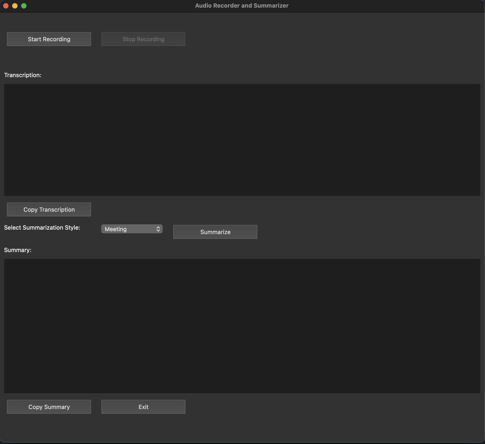

# Audio Recorder and Summarizer

This project provides a GUI application for recording audio, transcribing it using OpenAI's Whisper model, and summarizing the transcription using OpenAI's GPT-4 model.



***The whole project was generated by GPT4o to explore the capabilities of a LLM.***

The code was 99% as is. Things I need to adjust are

- Need to change to open-whisper package in the requirements.txt file. Yes, the requirements.text is generated by GPT4o as well.
- Need to comment out the line "device = torch.device('mps')" in the code since I could not get PyTorch to work with M1 chips.
- It uses old OpenAI API. Need to run `openai migrate` to update code.
- Need to use Codeium to fix some of the markdown lint issues. Yes, this README.md is generated by GPT4o as well.

***Exciting and scary!!!***

## Requirements

- Python 3.8+
- pip

## Setting Up the Python Environment

### Using `venv`

1. Create a virtual environment:

    ```bash
    python -m venv venv
    ```

2. Activate the virtual environment:
    - **Windows**:

        ```bash
        venv\Scripts\activate
        ```

    - **macOS and Linux**:

        ```bash
        source venv/bin/activate
        ```

3. Install the required packages:

    ```bash
    pip install -r requirements.txt
    ```

### Using `miniconda`

1. Create a new conda environment:

    ```bash
    conda create --name audio-summarizer python=3.8
    ```

2. Activate the conda environment:

    ```bash
    conda activate audio-summarizer
    ```

3. Install the required packages:

    ```bash
    pip install -r requirements.txt
    ```

## Installation

1. Clone the repository:

    ```bash
    git clone https://github.com/your-username/your-repo.git
    cd your-repo
    ```

2. Create a `.env` file in the root directory of the project and add your OpenAI API key:

    ```plaintext
    OPENAI_API_KEY=your_openai_api_key
    ```

## Usage

Run the application:

```bash
python main.py
```
